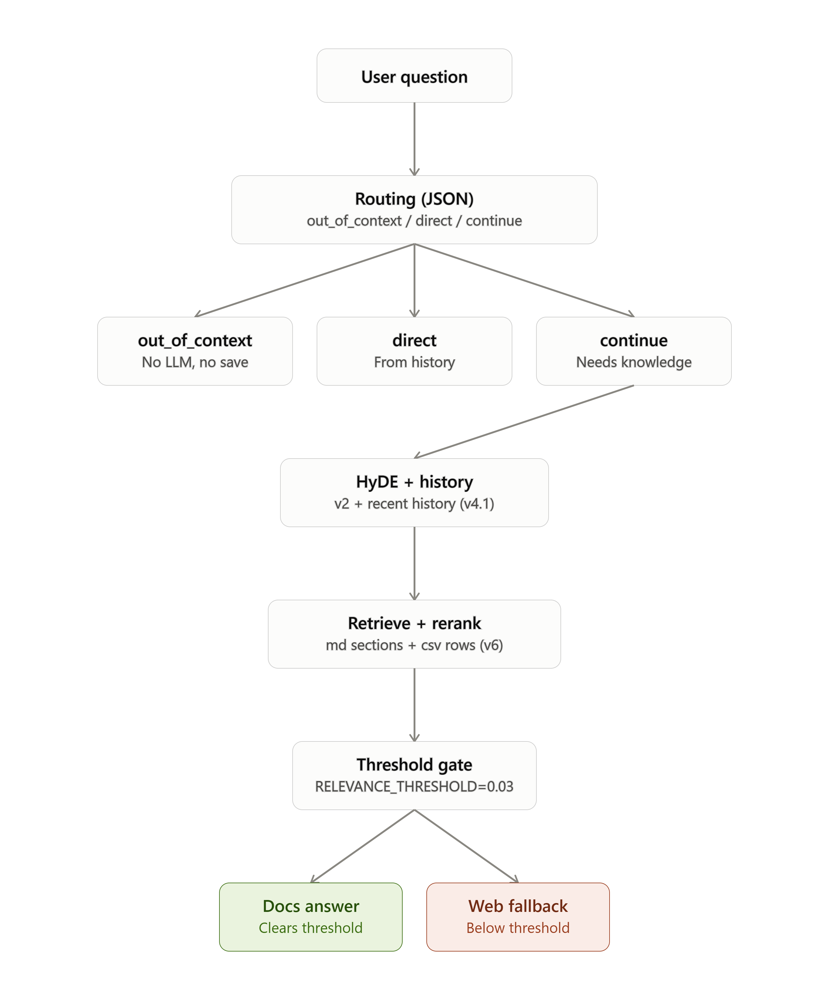
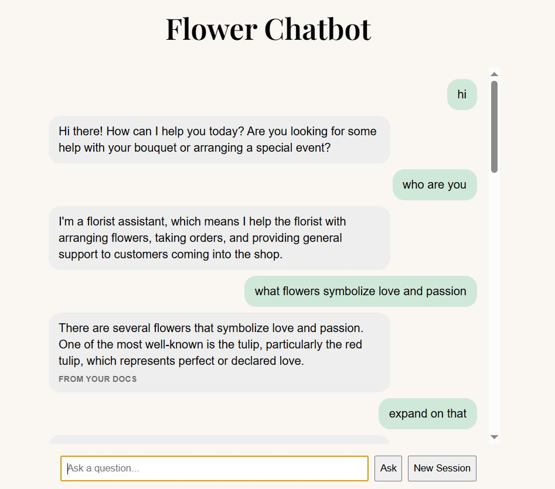
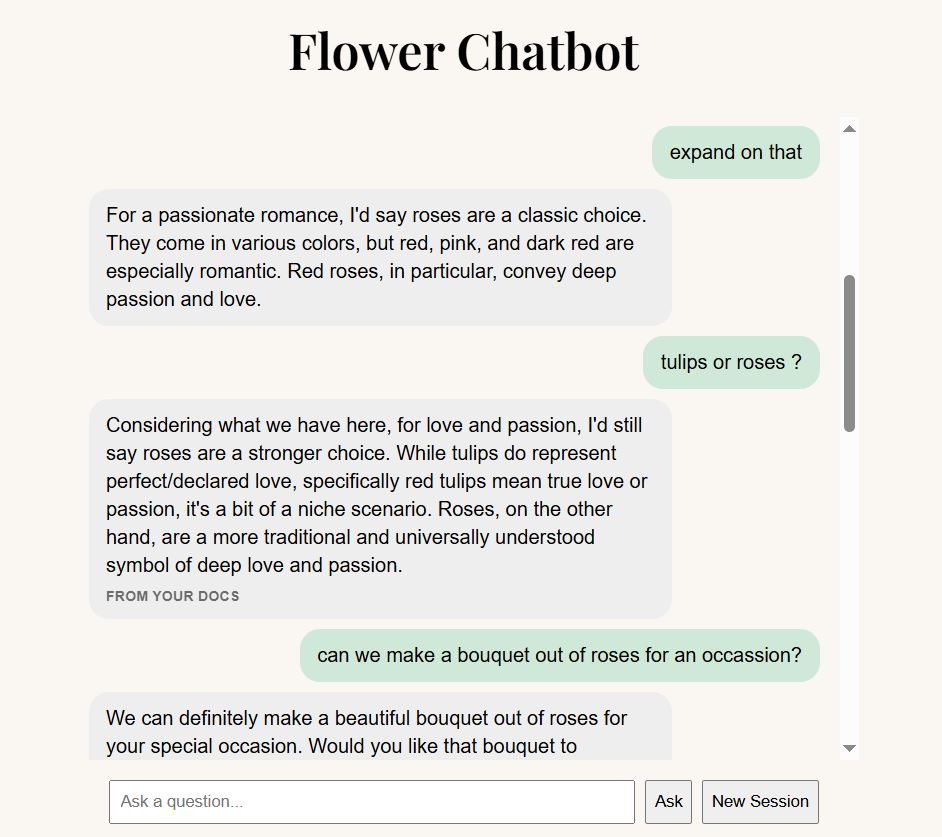
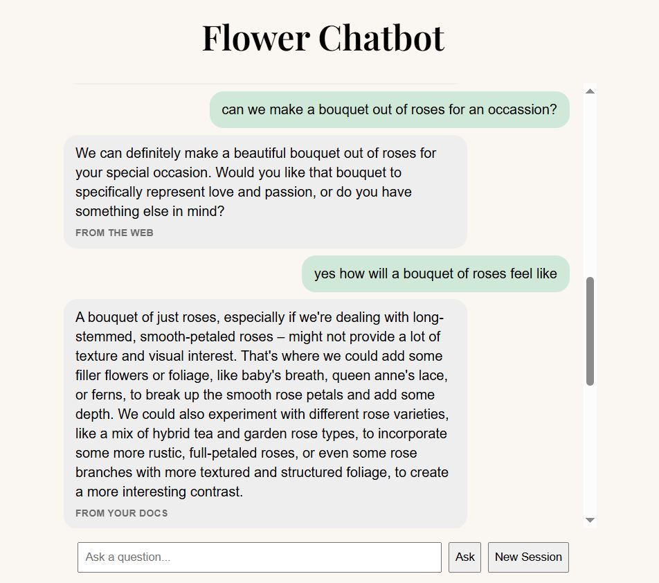
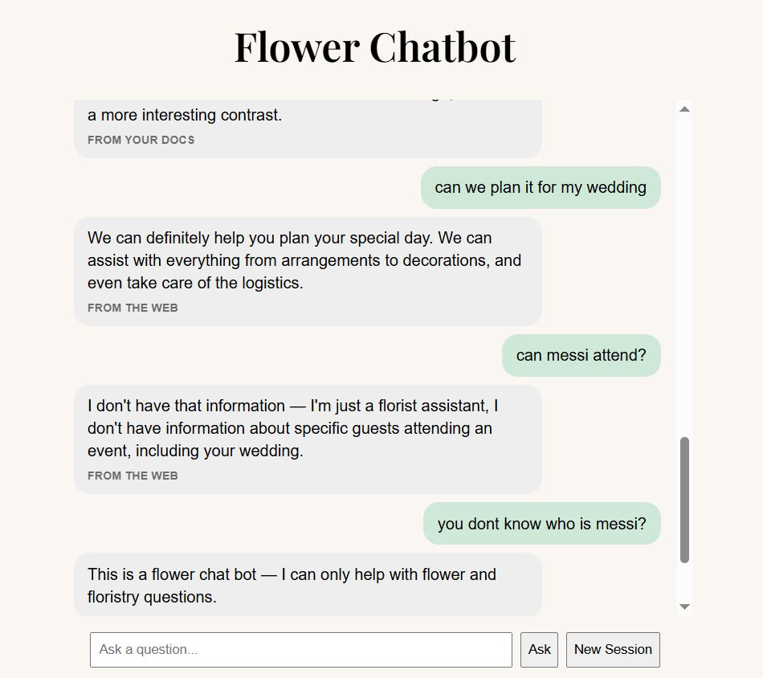

# RAG Flower Chatbot with Web Search Fallback

A chatbot that answers primarily from your own documents (RAG), falling back to live web search when local knowledge isn't sufficient. Built on top of the AI-103 Foundry SDK / Responses API material.

> See it in action: [Sample End-to-End Interaction](#sample-end-to-end-interaction--local-development-wrap-up) — a real run with screenshots walking through the full pipeline (routing, HyDE, retrieval, reranking, web fallback, and the off-topic refusal).

## Concept

Ask it things like:
- "What should I know before buying tulips?"
- "Can I put roses and carnations in the same vase?"
- "What flowers should I avoid mixing with lilies?"

## Stack (Grand Plan / Target)

- **LLM**: Azure OpenAI via Responses API
- **Embeddings**: `text-embedding-3-small` (Azure OpenAI)
- **Vector DB**: Chroma (local for v1, Azure AI Search later)
- **Chunking**: LangChain `MarkdownHeaderTextSplitter`
- **Web search fallback**: `web_search` tool
- **Backend**: FastAPI
- **Frontend**: Basic HTML/CSS/JS (v1), improved later

> **Note:** v1 uses local equivalents for LLM and embeddings, and stays local through HyDE (v2) and reranking (v3, both completed) since both are free — see [Roadmap](#roadmap) and [v1 — Core RAG](#v1--core-rag-local-only-completed) for what's actually running today.

## Roadmap

### v1 — Core RAG (local only) — ✅ Completed
- Load MDs → chunk → embed → store in Chroma
- FastAPI backend, single `/chat` endpoint
- Basic styled HTML/JS frontend
- No memory, no web search — just "ask your docs"

### v2 — HyDE retrieval — ✅ Completed
- LLM generates a hypothetical answer to the question first
- Embed that hypothetical answer (not the raw question) and use it to query Chroma
- Stays fully local (local LLM + local embeddings)

### v3 — Reranking — ✅ Completed
- Retrieve a larger top-k candidate set from Chroma
- Add a local reranker (e.g. cross-encoder like `bge-reranker` or MiniLM MS MARCO) to reorder candidates by relevance
- Pass only top reranked chunks to the LLM as context
- Stays fully local

### v4 — Add memory — ✅ Completed
- Session-based conversation tracking
- Multi-turn context in the UI
- v4.1 — HyDE hypothetical-answer generation considers recent conversation history, not just the latest question
- v4.2 — Summarize-and-drop older turns once history exceeds a limit, to bound token cost on long sessions

### v5 — Relevance-Gated Retrieval + Web Search Fallback — ✅ Completed
- Reranker scores are kept and normalized (0-1), instead of discarded after picking top-k
- Chunks are filtered by a relevance threshold (tuned to `0.03` against ~80 test questions), capped at `TOP_K`
- If nothing clears the threshold, the LLM is forced (`tool_choice="required"`) to call a `web_search` tool with its own reformulated query, with a text-parsing fallback for local models that don't honor forced tool calls
- A routing step also catches greetings/small talk/meta questions and history-only follow-ups ("expand on that"), answering directly without docs or web
- UI shows source: "from your docs" vs "from the web" (no tag for direct answers)

### v5.1 — JSON Routing + `out_of_context` Route — ✅ Completed
- Routing LLM call switched from a bare YES/NO word to structured JSON output, to reduce misfires where the model answers instead of routing
- Adds a third route, `out_of_context`, for questions with no flower/floristry relevance — static refusal, no LLM call, no session write, skips HyDE/retrieval/web entirely
- `direct` and `continue` routes behave the same as v5's `YES`/`NO`

### v6 — Expanded Knowledge Base: More MDs + CSV Support — ✅ Completed
- Populate the database with more `.md` files covering additional flower/floristry topics
- Add `.csv` as a second supported file type — `fill_db.py` branches by extension, each row becomes one chunk
- No changes to retrieval, reranking, or routing — new content flows through the existing pipeline unchanged

### v7 — Cloud LLM & Embeddings swap
- Swap local LLM → Azure OpenAI (Responses API)
- Swap local embeddings → `text-embedding-3-small` (Azure OpenAI)
- Update `.env` / config for Azure credentials and endpoints

### v8 — Polish & UX
- Streaming responses in the UI (typing effect)
- Better frontend (React or improved HTML/CSS)
- Error handling, loading states

### v9 — Production readiness (end goal)
- Swap Chroma → Azure AI Search (cloud-hosted vector DB)
- Deploy FastAPI backend to Azure (App Service or Container Apps)
- Auth (basic login or API key protection)
- Logging/monitoring
- Deployed, shareable link

## End Goal

A deployed, cloud-hosted RAG chatbot with web search fallback, multi-document support, streaming UI, and proper auth — a complete showcase project demonstrating the full AI-103 skill set in a real app.

---

## v1 — Core RAG (local only) — Completed

To avoid over-scoping, v1 cut everything down to the smallest working loop.

### v1 Stack
- **LLM**: Local model via OpenAI-compatible client (Ollama), using `chat.completions.create`
- **Embeddings**: Local `sentence-transformers/all-mpnet-base-v2` via Chroma's built-in embedding function
- **Vector DB**: Chroma (persistent local client)
- **Chunking**: LangChain `MarkdownHeaderTextSplitter` (split on `##` → `section`)
- **Backend**: FastAPI, single `/chat` endpoint
- **Frontend**: Lightly styled HTML/JS (chat bubbles, custom font) — more polished than originally scoped "text box only," but still v1-simple: no memory, no streaming, no multi-turn

### v1 Source Files

| File | Purpose | Source |
|---|---|---|
| `flower_symbolism.md` | Flower to meaning lookup | Wikipedia: "List of plants with symbolism" |
| `flower_compatibility.md` | Vase life, ethylene sensitivity, sap toxicity, bad pairings | Written by us, based on public florist/horticulture sources |

### v1 Files

| File | Purpose |
|---|---|
| `utils.py` | Shared helpers — embedding function, Chroma collection getter, LLM client getter, chunk retrieval, context building |
| `fill_db.py` | Loads and chunks source `.md` files, embeds them, upserts into Chroma collection |
| `main.py` | FastAPI app — `/chat` endpoint, serves static frontend |
| `query_db.py` | CLI dev/debug tool — query the Chroma collection directly and inspect retrieved chunks/distances |
| `index.html` | Frontend — chat UI (input box, bubbles, fetch to `/chat`) |

### v1 Build Steps
1. Prepared the two source files (clean markdown/text)
2. Chunked each file (`MarkdownHeaderTextSplitter`)
3. Embedded chunks using local `sentence-transformers/all-mpnet-base-v2` and stored in Chroma
4. Built FastAPI backend: single `/chat` endpoint — takes a question, retrieves top-k chunks, calls local LLM with retrieved context, returns the answer
5. Built minimal styled HTML/JS frontend: input box, submit button, response display
6. Added `query_db.py` for local retrieval testing/debugging
7. Tested end-to-end locally

---
 
## v2 — HyDE Retrieval — Completed
 
**What:** Before embedding the user's question, ask the local LLM to generate a hypothetical (made-up) answer. Embed that hypothetical answer instead of the raw question, then use it to query Chroma. Hypothetical answers resemble real document chunks more closely than bare questions do, improving retrieval match quality.
 
### v2 Stack, Source files
- Same as v1 — no new dependencies

### v2 Files
 
| File | Purpose |
|---|---|
| `utils.py` | Modified — added `generate_hypothetical_answer()` and `embed_text()`; `retrieve_chunks()` now accepts an optional `query_embedding` param |
| `main.py` | Modified — defines `HYDE_SYSTEM_PROMPT`; `/chat` now generates a hypothetical answer, embeds it, and retrieves with that embedding before the final LLM call |
| `query_db.py` | Modified — defines `HYDE_SYSTEM_PROMPT`; added `--hyde` CLI flag to compare HyDE vs raw-query retrieval |
 
### v2 Build Steps
1. Added `generate_hypothetical_answer(question, client, model, system_prompt)` to `utils.py` — LLM generates a hypothetical answer from the user's question
2. Added `embed_text(text)` to `utils.py` — embeds arbitrary text using the same local embedding function (`all-mpnet-base-v2`)
3. Modified `retrieve_chunks()` in `utils.py` to accept an optional `query_embedding` — uses it via `collection.query(query_embeddings=...)` if provided, falls back to raw-question `query_texts` otherwise (backward compatible)
4. Updated `/chat` in `main.py`: question → HyDE generation → embed → retrieve → build context → final LLM call
5. Added `--hyde` flag to `query_db.py` to test HyDE vs raw-query retrieval side-by-side, printing the mode and hypothetical answer used
6. Tested end-to-end: `query_db.py --hyde` vs `query_db.py` for retrieval comparison, and full `/chat` flow via `uvicorn main:app --reload`

---
 
## v3 — Reranking — Completed
 
**What:** HyDE (v2) retrieves a candidate set using an embedding of a hypothetical prose answer, which can bias against short/structured content and doesn't always surface the most relevant chunks in the right order. Reranking adds a second pass: retrieve a wider candidate pool from Chroma, then use a cross-encoder to score each candidate directly against the raw question and reorder by true relevance before building context.
 
**Ties into v2** widening the initial top-k and reranking against the raw question (not the HyDE embedding) helps recover relevant chunks — including structured/CSV rows, if added later — that HyDE's prose bias may have ranked lower. Reranking fixes ordering/precision within the retrieved pool; it can't recover chunks HyDE excluded entirely, so top-k width still matters.
 
### v3 Stack
- Same as v2 — one new dependency: a local cross-encoder reranker (e.g. `cross-encoder/ms-marco-MiniLM-L-6-v2` via `sentence-transformers`, likely already available as it's part of the `sentence-transformers` package)
- **LLM**: Local model via Ollama (unchanged)
- **Embeddings**: Local `sentence-transformers/all-mpnet-base-v2` (unchanged)
- **Reranker**: Local cross-encoder (new)
- **Vector DB**: Chroma (unchanged)

### v3 Files
 
| File | Purpose |
|---|---|
| `utils.py` | Modified — add `get_reranker()` (lazy-load-with-cache, same pattern as embedding model) and `rerank_chunks(question, chunks, top_n)` |
| `main.py` | Modified — `lifespan` background-loads reranker alongside embedding model; `/chat` retrieves a wider candidate pool, reranks, then builds context from top reranked chunks |
| `query_db.py` | Modified — add `--rerank` flag to compare raw vs HyDE vs HyDE+rerank retrieval side-by-side |
 
### v3 Build Steps
1. Add `get_reranker()` to `utils.py` — lazy-load a local cross-encoder model, cached after first load (same pattern as `get_embedding_function()`)
2. Add `rerank_chunks(question, chunks, top_n)` to `utils.py` — scores each (question, chunk) pair with the cross-encoder, sorts descending, returns top `top_n`
3. Widen initial retrieval: increase `n_results` in the `retrieve_chunks()` call (e.g. top_k=10 candidates) before reranking down to a smaller final set (e.g. top 3)
4. Update `lifespan` in `main.py` to also background-load the reranker at startup (alongside the embedding model)
5. Update `/chat` in `main.py`: HyDE-embed → retrieve wide candidate pool → rerank with raw question → build context from top reranked chunks → final LLM call
6. Add `--rerank` flag to `query_db.py` to compare raw / HyDE / HyDE+rerank retrieval side-by-side
7. Test retrieval quality: check whether reranking recovers relevant chunks that HyDE's prose bias ranked lower

---

## v4 — Add Memory — Completed

**What:** Track conversation history per session so follow-up questions have context. Uses manual history (list of messages sent on every call), not `previous_response_id` — that's a Responses API feature and this stack runs on `chat.completions.create` via Ollama, which is stateless per call.

### v4 Stack
- Same as v3 — no new dependencies (in-memory session store, no DB)

### v4 Files

| File | Purpose |
|---|---|
| `utils.py` | Modified — add in-memory `SESSIONS` dict, `get_session_history(session_id)` / `append_to_session(session_id, role, content)` / `clear_session(session_id)` helpers |
| `main.py` | Modified — `ChatRequest` gains optional `session_id`; generates a new one if absent; builds LLM messages as system prompt + prior history + new question; appends question/answer to session after response; returns `session_id` in response; adds `DELETE /session/{session_id}` endpoint to clear a session's history |
| `index.html` | Modified — stores `session_id` in a JS variable after first response, sends it on subsequent `/chat` calls; adds a "New Session" button that clears local `session_id` and chat UI, and tells the backend to drop that session's history |

### v4 Build Steps
1. Add `SESSIONS = {}` to `utils.py` — in-memory dict mapping `session_id` → list of message dicts
2. Add `get_session_history(session_id)` (using `.get(session_id, [])` so an unknown ID returns empty history instead of erroring), `append_to_session(session_id, role, content)`, and `clear_session(session_id)` helpers to `utils.py`
3. Update `ChatRequest` in `main.py` to accept optional `session_id`; generate a new UUID if not provided
4. Update `/chat` in `main.py`: build final LLM call's `messages` as system prompt + full session history + new user question (HyDE/retrieval stay unchanged — based on the latest question only, as in v3)
5. After getting the answer, append the user question and assistant answer to that session's history
6. Return `session_id` in the `/chat` response so the frontend can persist and resend it
7. Add `DELETE /session/{session_id}` endpoint in `main.py` calling `clear_session()`
8. Update `index.html`: store `session_id` from the first response, include it in the body of subsequent `/chat` POSTs
9. Add a "New Session" button to `index.html` — on click, calls `DELETE /session/{session_id}` (if one exists), clears the local `session_id` variable, and clears the chat bubble UI
10. Test multi-turn flow: ask a question, then a follow-up that depends on prior context, confirm the LLM sees history
11. Test reset: start a session, ask a follow-up, click "New Session", confirm next question gets no prior context and UI is empty

---

## v4.1 — HyDE-Aware History — Completed
**Design discussion — should HyDE see prior history?**

The open question was whether `generate_hypothetical_answer()` should only take the latest question, or the question plus recent conversation history.

The problem: v4 memory only helps the *final* LLM call — retrieval happens *before* that, via HyDE, and still only sees the latest question in isolation. A follow-up like "What about roses?" gives HyDE nothing to anchor on. HyDE would generate a generic hypothetical about roses in general, missing whatever the conversation was actually about (e.g. vase compatibility, toxicity). Retrieval then queries Chroma with that ungrounded hypothetical and pulls back irrelevant chunks — so the follow-up looks broken at the retrieval step even though memory "works" at the chat-history level.

The fix isn't to hand HyDE the *entire* session history either. Full history adds tokens per call for no real benefit, and older turns can dilute the hypothetical answer with context that's no longer relevant to the current question.

**Decision:** `generate_hypothetical_answer()` takes the latest question plus the last 2 turns of history if available (fewer if the session has less). This keeps HyDE grounded on follow-ups without paying for or diluting on irrelevant older context.

### v4.1 Files

| File | Purpose |
|---|---|
| `utils.py` | Modified — `generate_hypothetical_answer()` now accepts recent-history turns (latest 2 if available) and includes them in the prompt |
| `main.py` | Modified — `/chat` passes the latest question + last 2 turns of session history (if available) into `generate_hypothetical_answer()` |

### v4.1 Build Steps (Planned)
1. Update `generate_hypothetical_answer()` in `utils.py` to accept optional recent-history turns and include them in the prompt to the LLM
2. Update `/chat` in `main.py`: pass the latest question + last 2 turns of session history (if available) into `generate_hypothetical_answer()`
3. Test: ask a question, then a follow-up like "what about roses?", confirm HyDE's hypothetical answer reflects the prior turn's context and retrieval pulls relevant chunks

---

## v4.2 — History Trimming — Completed
 
**Design discussion — trimming**
 
The problem: session history has no cap. If someone chats for many turns, every `/chat` call sends the *full* history to the LLM — cost and latency creep the longer a conversation runs, even on local Ollama.
 
**Decision:** summarize-and-drop. Once `turns` exceeds `HISTORY_TURN_LIMIT`, collapse everything except the last 4 messages (2 user+assistant pairs) into a short LLM-generated summary, and keep that summary plus those last 4 raw turns — instead of sending everything forever.
 
To keep the summary itself from growing unbounded as a long session keeps triggering trims, each trim regenerates the summary from scratch rather than appending to it: the old summary plus the newly-dropped turns are fed into the LLM together and replaced with one fresh summary. This keeps the summary roughly the same size no matter how long the session runs, instead of turning into a summary-of-a-summary-of-a-summary that grows forever.
 
`append_to_session()` appends a single message (role + content) to the session's `turns` list. A separate `trim_session()` function is called once per turn, from `main.py`, only after *both* the user question and assistant answer have been appended. It checks whether `turns` has exceeded `HISTORY_TURN_LIMIT`, and only when that's true does it make a summarization LLM call — most turns don't trigger it at all, and trimming only ever happens at a pair boundary.
 
Trimming always keeps the last 4 messages (2 full turns) untouched, since v4.1's HyDE lookup reads from that same tail — this guarantees HyDE's lookback window is never affected by trimming.
 
**Hallucination fix:** early testing showed the summarization call could invent details (names, settings, events) not present in the actual conversation, and — since each trim re-feeds the previous summary back in — a hallucination could persist and compound across trims. Fixed by setting `temperature=0` and `max_tokens=250` on the summarization call, and tightening `SUMMARIZE_SYSTEM_PROMPT` to explicitly forbid including anything not explicitly stated in the source turns.
 
### v4.2 Files
 
| File | Purpose |
|---|---|
| `utils.py` | Modified — add `HISTORY_TURN_LIMIT` constant; add `summarize_history(old_summary, dropped_turns, client, model, system_prompt)` (`temperature=0`, `max_tokens=250`); session storage shape changes to `{"summary": str \| None, "turns": [...]}`; `append_to_session()` appends a message to `turns`; new `trim_session(session_id, client, model, summarize_system_prompt, keep_last=4)` checks the limit and, if exceeded, summarizes everything except the last `keep_last` messages; `get_session_history()` prepends the summary as a system message when one exists |
| `main.py` | Modified — defines `SUMMARIZE_SYSTEM_PROMPT` (alongside `SYSTEM_PROMPT`/`HYDE_SYSTEM_PROMPT`, explicitly forbids inventing details); calls `trim_session()` once per turn, right after both `append_to_session()` calls |
 
### v4.2 Build Steps
1. Add `HISTORY_TURN_LIMIT` constant to `utils.py`; add `SUMMARIZE_SYSTEM_PROMPT` to `main.py` (kept alongside the other prompts for consistency)
2. Change session storage shape to `{"summary": None, "turns": []}` per session
3. Add `summarize_history(old_summary, dropped_turns, client, model, system_prompt)` to `utils.py` — feeds the old summary (if any) plus newly-dropped turns into the LLM with `temperature=0` and `max_tokens=250`, returns one fresh summary
4. `append_to_session()` in `utils.py` appends a single message (role + content) to the session's `turns` list
5. Add `trim_session(session_id, client, model, summarize_system_prompt, keep_last=4)` to `utils.py` — if `len(turns) > HISTORY_TURN_LIMIT`, summarizes everything except the last `keep_last` messages, replaces `summary`, keeps only the last `keep_last` in `turns`
6. Update `get_session_history()` — return `[{"role": "system", "content": f"Earlier conversation summary: {summary}"}] + turns` when a summary exists, else just `turns`
7. Call `trim_session()` in `main.py`, once per turn, immediately after both `append_to_session()` calls (user question + assistant answer) — guarantees trimming only ever happens at a pair boundary
8. Tighten `SUMMARIZE_SYSTEM_PROMPT` to forbid inventing facts/names/events not explicitly present in the source turns, after observing hallucinated details compounding across trims
9. Test: chat past the turn limit, confirm older turns get summarized (accurately, no invented details) and dropped while the last 4 raw turns and the summary are still passed to the LLM and to HyDE

---

## v5 — Relevance-Gated Retrieval with Web Search Fallback — Completed

**What:** v3's reranker always hands the LLM a fixed top-3 chunks, regardless of whether they're actually relevant to the question. v5 makes relevance a measurable, filterable signal — so the number of chunks used reflects real document coverage — and adds a web search fallback for questions local docs don't cover at all. Along the way, testing surfaced a second gap (routing every turn through docs-or-web breaks on greetings and follow-ups), which got folded into this version too.

### Approach
- Reranker scores every candidate chunk against the question (already happens in v3) — the score is kept instead of discarded
- Scores are normalized to 0-1 (sigmoid) so the threshold can be tuned by eye
- Chunks are filtered by `RELEVANCE_THRESHOLD`, capped at `TOP_K` — 0 to 3 chunks depending on actual relevance, not always 3
- If nothing clears the threshold, a web search is triggered instead of forcing an answer from weak context
- Each response is tagged `source: "docs"`, `"web"`, or `"direct"` so the frontend can show where the answer came from

**Why the reranker score, not Chroma's raw distance:** Chroma's distance is tied to the embedding model's vector space and has no fixed range — it will also change when v7 swaps embeddings. The reranker score is already computed, question-specific, and reusable for both the chunk-count decision and the fallback trigger — one signal, two uses.

### Threshold tuning — what actually happened

The original plan was to eyeball a threshold from a handful of test questions. In practice this took a larger batch to get right:

1. **First 3 questions** suggested real matches scored ~0.08–0.98 and irrelevant ones scored ~0.0000 — a clean, wide gap.
2. **A larger batch (~80 questions)** across both docs, deliberately including borderline and out-of-scope cases, confirmed the same pattern held at scale: genuine matches consistently scored well above the confirmed noise floor (`0.0000`) from every out-of-scope test question.

**Decision:** `RELEVANCE_THRESHOLD = 0.03`. This sits below the normal range of true positives and comfortably above the confirmed noise floor. Tuned using `query_db.py` (see below) against ~80 real questions, not the placeholder guess from the original plan.

**Sample results**, spanning the full score range from the tuning run (full set in `questions.txt`):

| Score | Question | Doc |
|---|---|---|
| 0.9997 | What's the meaning of a peony? | symbolism |
| 0.9950 | What does euphorbia sap do to other flowers? | compatibility |
| 0.9803 | What flowers should I use for a funeral arrangement? | symbolism |
| 0.9394 | What's the best way to recut flower stems? | compatibility |
| 0.7927 | How can I make my cut flowers last longer? | compatibility |
| 0.6878 | What's the meaning behind giving someone a sunflower? | symbolism |
| 0.4338 | What flowers are toxic to cats? | compatibility |
| 0.3212 | Which flowers work well as an anchor in a mixed bouquet? | compatibility |
| 0.1675 | What flowers should I avoid giving for a somber occasion? | symbolism |
| **0.0944** | Why shouldn't I put roses and carnations in the same vase? | compatibility |
| **0.0813** | What flowers should I avoid mixing with lilies? | compatibility |
| — *threshold = 0.03* — | | |
| 0.0000 | Who won the last World Cup? | *n/a* |
| 0.0000 | What's the capital of France? | *n/a* |
| 0.0000 | How do I fix a Python import error? | *n/a* |

### How the web search fallback works
When nothing clears the threshold, the raw user question isn't searched directly — the LLM is asked to write the search query itself, since it can phrase follow-ups (e.g. "what about roses?") into a proper standalone query.

This uses tool calling: the LLM is given a `web_search` function tool and `tool_choice="required"`, forcing it to use the tool rather than answer directly, with `temperature=0` and `max_tokens=30` since only a short, precise search phrase is needed. The returned query is run through `web_search()` (using `duckduckgo-search`), and the results are formatted as plain context text fed into the same shared final-answer LLM call used by the docs path (see "Simplification" below) — no separate web-only system prompt, no tool-call/tool-result message replay.

Ollama has no hosted search capability, so the model can only *request* a search via a function tool — execution and feeding results back happens in application code. This mirrors the shape a future hosted-tool version (e.g. Azure OpenAI's `{"type": "web_search"}`) would take, so this design doubles as practice for that later swap — only the model and search backend change, not the shape.

**Reliability gap found during testing:** `tool_choice="required"` isn't consistently honored by Ollama's OpenAI-compatible endpoint — `llama3.2:3b` was observed echoing its attempted tool call as malformed JSON text in `content` instead of populating `tool_calls`, crashing the original implementation (`tool_calls[0]` on `None`). Fixed with a fallback: if `message.tool_calls` is empty, regex-scrape a `"query": "..."` pattern out of `content`, falling back to the raw question if even that fails. This keeps the primary path matching Azure's real tool-call shape and only degrades gracefully for local models that don't honor the forced call.

### Routing gap found during testing — direct-answer path
Testing surfaced a case the docs-or-web split didn't handle: a bare follow-up like "expand on that" has no semantic content of its own, so it fails the relevance threshold regardless of whether the docs actually cover the topic, and gets misrouted to web search. The same problem showed up for greetings and meta questions ("hi", "who are you") — especially on the very first turn, with no history to fall back on either.

**Fix:** a third route, checked before HyDE/retrieval run at all. One LLM call (`ROUTING_SYSTEM_PROMPT`, `temperature=0`, `max_tokens=2`) decides YES/NO: can this turn be answered directly from conversation history and general ability, with no new flower knowledge or web search needed? YES routes to a direct answer using the same `SYSTEM_PROMPT` + history, tagged `source = "direct"`, skipping HyDE/retrieval/rerank/web entirely. NO falls through to the existing docs → threshold → web flow, unchanged.

**Known limitation:** `llama3.2:3b` doesn't always follow the "respond with exactly one word" instruction. The prompt went through several rounds of tightening to improve this. Parsing stays conservative regardless: only a response starting with `YES` counts as `YES`; anything else defaults to `NO` and falls through to the normal docs/web flow, so a misfire costs an unnecessary lookup, never a blocked answer. Occasional misroutes on unusual phrasing are still possible. Revisiting with a smaller model dedicated to routing only (e.g. one with stronger structured-output reliability) is a candidate follow-up, not yet done.

### v5 Stack (additions)
- `duckduckgo-search` for web fallback

### v5 Files

| File | Purpose |
|---|---|
| `utils.py` | `rerank_chunks()` returns all scored chunks (normalized 0-1), not just top-n; adds `RELEVANCE_THRESHOLD = 0.03`; adds `WEB_SEARCH_TOOL_SCHEMA`; adds `web_search(query, max_results=3)` using `duckduckgo-search` |
| `main.py` | Adds a routing step (`ROUTING_SYSTEM_PROMPT`) before HyDE/retrieval, for direct/history-only answers (`source = "direct"`); filters reranked chunks by threshold, capped at `TOP_K`; empty → forced tool call (with text-parsing fallback for local models) → execute search → shared final-answer call; `source` (`"docs"` \| `"web"` \| `"direct"`) added to response |
| `query_db.py` | Rewritten as a looping CLI tool (reads questions until blank/EOF, so input can be piped from a file) — prints per-question `top`/`2nd`/`gap` scores plus a full end-of-session summary sorted by score, for threshold tuning |
| `questions.txt` | Combined batch of ~80 test questions (in-scope, borderline, out-of-scope) used to tune `RELEVANCE_THRESHOLD`; pipe into `query_db.py --hyde --rerank < questions.txt` to reproduce |
| `index.html` | Shows "from your docs" / "from the web" tag per answer bubble; no tag shown for `"direct"` answers |

### v5 Build Steps (as completed)
1. Sigmoid-normalize reranker scores in `rerank_chunks()`; return all scored chunks, sorted
2. Add `RELEVANCE_THRESHOLD` constant (placeholder, tuned later)
3. Define `WEB_SEARCH_TOOL_SCHEMA` (name: `web_search`, param: `query: string`)
4. Add `duckduckgo-search` dependency; add `web_search(query, max_results=3)` → list of `{snippet, url}`
5. In `/chat`: filter scored chunks by threshold, cap at `TOP_K`
6. Chunks found → existing flow, `source = "docs"`
7. Empty → LLM call with `tools=[WEB_SEARCH_TOOL_SCHEMA]`, `tool_choice="required"`, `temperature=0`, `max_tokens=30`; added a fallback for when `tool_calls` comes back empty (local model reliability issue, see above)
8. Parse the tool call's (or fallback-parsed) query
9. Run `web_search(query)`
10. Format results as plain context text; feed into the same shared final-answer call used by the docs path (simplified from the original tool-call/tool-result message replay plan)
11. Set `source = "web"`
12. Rewrite `query_db.py` into a looping, pipeable CLI tool that prints per-question scores and an end-of-session summary
13. Run ~80 test questions (mixed in-scope, borderline, out-of-scope) through `query_db.py`; tune `RELEVANCE_THRESHOLD` to `0.03` based on the results
14. Update `index.html` to render the source tag
15. Add the routing step (`ROUTING_SYSTEM_PROMPT`) for direct/history-only answers, discovered as a necessary addition during testing (see above)
16. Test: docs path unaffected; no-chunk path triggers forced tool call and falls back gracefully when the local model doesn't honor it; greetings and simple follow-ups route to `"direct"` without hitting docs/web; a real docs question still routes correctly afterward

---

## v5.1 — JSON Routing + `out_of_context` Route — Completed

**What:** v5's routing step uses a single-word YES/NO prompt, but `llama3.2:3b` doesn't reliably follow "respond with exactly one word" — it sometimes answers the question directly instead of routing it, corrupting the decision. Forcing a JSON response format is a more robust instruction than a bare word for controlling model behavior. Along the way, the binary YES/NO split gets widened to three routes, adding an `out_of_context` short-circuit for questions with no flower/floristry relevance at all — previously these fell through to `NO` and burned a full HyDE → retrieve → rerank → (likely) web-search cycle just to get refused at the end.

### Approach
- Routing LLM call now returns structured JSON (`{"route": "..."}`) instead of a bare word — a more constrainable output shape than free text
- Three routes replace the YES/NO split:
  - `out_of_context` — question isn't flower/floristry-related at all → static refusal, no LLM call, no session write, skips HyDE/retrieval/web entirely
  - `direct` — answerable from conversation history/general ability, no new flower knowledge needed → unchanged from v5's `YES` path
  - `continue` — needs real flower knowledge → unchanged from v5's `NO` path, falls through to docs → threshold → web

**Why JSON over a bare word:** a single word gives the model nothing to anchor to structurally — it's easy for a small local model to drift into "helpfully" answering instead. A JSON object with a fixed key gives the model a shape to fill rather than an instruction to remember, which tends to hold up better under weaker instruction-following.

**Why `out_of_context` skips the session entirely:** appending a refused exchange to history would carry it into the summary and into every future prompt for that session — polluting context for zero benefit, since there's nothing about the refusal worth remembering.

### v5.1 Files

| File | Purpose |
|---|---|
| `main.py` | `ROUTING_SYSTEM_PROMPT` rewritten for JSON output defining all three routes; routing call `max_tokens` increased (2 → ~20) to fit JSON; parses `route` key with regex fallback and safe default; new `OUT_OF_CONTEXT_MESSAGE` constant; `/chat` branches three ways instead of two — `out_of_context` returns the static message immediately with no LLM call and no `append_to_session()` |

### v5.1 Build Steps
1. Rewrite `ROUTING_SYSTEM_PROMPT` to instruct JSON-only output: `{"route": "out_of_context" | "direct" | "continue"}`, with each route defined in-prompt
2. Increase routing call `max_tokens` from 2 to ~20 to accommodate JSON structure
3. Parse routing response: `json.loads()` first; on failure, regex-scrape `"route"\s*:\s*"(\w+)"`; if still unresolved or value isn't one of the three known routes, default to `continue` (same fail-safe philosophy as v5 — a misfire costs an unnecessary lookup, never blocks a real answer)
4. Add `OUT_OF_CONTEXT_MESSAGE` constant — static refusal string, e.g. "This is a flower chat bot — I can only help with flower and floristry questions."
5. Replace the `YES`/`NO` branch in `/chat` with a three-way branch:
   - `out_of_context` → return `OUT_OF_CONTEXT_MESSAGE` immediately; **no** `append_to_session()` call; no LLM call beyond routing; `source` set to a value the frontend renders with no tag (same as `direct`)
   - `direct` → unchanged from v5
   - `continue` → unchanged from v5
6. Test: off-topic question → static message returned, zero downstream LLM/HyDE/retrieval/web calls made, session history unchanged before/after
7. Test: follow-up sent immediately after an off-topic question → confirm no leftover artifact affects routing on the next turn
8. Test: greeting → still routes `direct`
9. Test: real flower question → still routes `continue`, full pipeline unaffected
10. Test: force malformed/non-JSON routing output → confirm parser falls back safely to `continue` without crashing

---

## v6 — Expanded Knowledge Base: More MDs + CSV Support

**What:** Every prior version was built and tuned against a tiny two-file corpus. v5.1 made the pipeline stable — routing reliably separates off-topic, conversational, and knowledge-needing questions — which is what finally makes it safe to scale the data up: growing the corpus no longer means growing the failure modes. v6 spends that headroom: more `.md` topics, plus a new file type (`.csv`), with the retrieval/routing pipeline itself untouched.

**Why CSV specifically needed v3 + v5 already in place:** HyDE (v2) embeds a generated *prose* hypothetical answer to query Chroma — it inherently favors chunks that read like prose. A CSV row (`"name: Rose, watering: moderate, sunlight: full"`) looks nothing like a hypothetical paragraph and would rank low on raw HyDE-embedding similarity alone, regardless of actual relevance. Without v3, CSV rows would rarely surface at all.

- **v3 (reranking)** is what makes CSV chunks viable in the first place: the cross-encoder scores candidates directly against the *raw question*, not the HyDE embedding — the readme's own v3 section already flags "structured/CSV rows, if added later" as a reason the candidate pool is widened before reranking, not just narrowed
- **v5 (relevance-gated threshold)** is what makes CSV chunks *trustworthy* once surfaced: a fixed top-3 would either force in a barely-relevant row or crowd out a better `.md` chunk. The 0-1 normalized threshold treats a CSV row and an `.md` section on equal footing — only surfaced if it actually clears the bar
- Net: v6 isn't just "add CSV support" — it's cashing in v3 + v5 specifically. CSV wasn't safely addable until reranking could recover it from HyDE's prose bias and the threshold could filter out the weak matches

### Approach
- Add more `.md` files — new flower/floristry topics beyond symbolism + compatibility, same `MarkdownHeaderTextSplitter` chunking as v1, zero code changes
- Add `.csv` as a second ingestible format — structured, tabular data that doesn't naturally fit markdown prose
- `fill_db.py` branches by file extension: `.md` → existing loader, `.csv` → new row-to-chunk loader
- Every other component — retrieval, reranking, threshold, routing, web fallback — stays exactly as-is; new chunks just enter the same Chroma collection and flow through the existing pipeline
- Validate against a broad test question set (spanning old + new `.md` topics, both CSVs, and off-topic questions) via `query_db.py --hyde --rerank`, confirming CSV rows actually clear `RELEVANCE_THRESHOLD` post-rerank and off-topic separation holds at the larger corpus size.

### v6 Files
 
| File | Purpose |
|---|---|
| `fill_db.py` | Branch on extension: `.md` → existing loader (unchanged); `.csv` → new `csv.DictReader`-based row-to-chunk loader |
| **New** `seasonal_availability.md` | Which flowers are in season by month/region, why seasonality matters, year-round fallback options |
| **New** `seasonal_availability.csv` | flower, peak_season, available_months, region |
| **New** `bouquet_design_principles.md` | Focal/filler/foliage roles, proportion/balance, shape styles, color theory, texture |
| **New** `wedding_and_event_planning.md` | Order timelines, quantity estimates by event size, ceremony vs. reception roles, personal flowers, budget allocation |
| **New** `handling_and_processing.md` | Conditioning, stem processing techniques, hydration solutions, cold storage/transport, common processing mistakes |
| **Modified** `flower_compatibility.md` | Sap toxicity section deepened into a full human toxicity/handling-precautions section (per-flower detail, severity, handling guidance) |
| **Modified** `vase_life.csv` | Added `water_temp_preference`, `recut_frequency_days`, `toxicity_level` columns — was just `flower, vase_life_days, ethylene_sensitivity` before |
| **Unmodified** `flower_symbolism.md` | Kept as is |

### v6 Build Steps
1. Decide new `.md` topics and draft the content
2. Decide `.csv` topic/schema and generate the data
3. Add `import csv` to `fill_db.py`; add a CSV loader — one chunk per row (`"{col}: {val}, ..."` format), metadata `{source: filename, section: <row identifier>}`
4. Branch the file-loading loop in `fill_db.py` by extension
5. Run `fill_db.py` against the expanded corpus, confirm chunk counts in Chroma
6. Re-run `query_db.py --hyde --rerank` against a refreshed test question set spanning old + new `.md` topics and the new CSV data — check whether `RELEVANCE_THRESHOLD = 0.03` still holds or needs re-tuning against the larger, more varied corpus
7. **CSV-specific check:** confirm CSV rows actually clear the threshold post-rerank for CSV-relevant questions, not just that they exist in Chroma — this is the part v3+v5 are supposed to make possible; also check whether `RERANK_CANDIDATES` needs widening now that short structured chunks compete in the same pool as prose chunks
8. Full `/chat` test: confirm new content surfaces correctly, `sources` attributes both `.md` sections and `.csv` rows correctly, existing topics/behavior unaffected

### v6 Validation Results
 
Ran a 100-question test set through `query_db.py --hyde --rerank` — 10 compatibility (regression), 10 symbolism (regression), 15 seasonal availability, 12 bouquet design, 12 wedding/event planning, 12 handling/processing, 10 toxicity/vase-life, and 19 off-topic questions.
 
- **Corpus loaded clean**: 146 chunks total (65 `.md` sections including intros, 75 CSV rows across `seasonal_availability_table.csv` and the expanded `vase_life.csv`), with correct `source`/`section` metadata and no ID collisions
- **Perfect off-topic separation**: all 19 unrelated questions scored exactly `0.0000` — zero false positives, `out_of_context` routing and the relevance threshold both held cleanly against the larger corpus
- **CSV rows surface correctly through HyDE + reranking**: this was the key risk flagged going into v6 — HyDE's prose-biased embedding could have buried short structured CSV rows entirely. The rerank step (v3) recovered them as designed, with CSV rows like `seasonal_availability_table.csv / Peony` and `vase_life.csv / Gerbera` scoring 0.87–0.97 on directly relevant questions, right alongside their `.md` counterparts
- **New `.md` content is well-indexed end to end**: every new topic (seasonal availability, bouquet design, wedding/event planning, handling/processing) returned correctly attributed top hits in the 0.9+ range
- **Deepened toxicity section performs well**: questions like "Is amaryllis sap dangerous to handle?" and "What is daffodil itch?" correctly surfaced the expanded `Human toxicity and handling precautions` section at 0.90+
- **Existing v5 behavior unaffected**: compatibility and symbolism regression questions scored consistent with prior versions — no regression from the corpus growth
- **`RELEVANCE_THRESHOLD = 0.03` confirmed to still hold** at the larger, more varied corpus size — no re-tuning needed. Any edge-case misses on ambiguous phrasing route to the existing web-search fallback (v5), which is the fallback's intended job

## Sample End-to-End Interaction — Local Development Wrap-Up
 
This walks through one realistic multi-turn session against `/chat`, chosen to exercise every route and feature built across v1–v6 in sequence. This marks the close of local development — routing, HyDE, retrieval, reranking, threshold gating, docs/web/direct/refusal handling, and session memory are all demonstrated together, end to end, on the finished pipeline.
 

 
Below is an actual local run against the UI, walked through turn by turn against the stages in the diagram above.
 
### Turn set 1 — greeting, identity, and a first docs hit
 

 
- **"hi"** → `direct` route. Answered from general ability with no retrieval at all — just the routing call plus one LLM call.
- **"who are you"** → `direct` route again. Same path, different content — the router correctly classifies both a greeting and an identity question as not needing flower knowledge.
- **"what flowers symbolize love and passion"** → `continue` route. HyDE generates a hypothetical answer, retrieval + reranking correctly surfaces `flower_symbolism.md`'s tulip entry, and the answer clears `RELEVANCE_THRESHOLD` — tagged **FROM YOUR DOCS**.
- **"expand on that"** → cut off mid-answer here, continued in the next screenshot.
### Turn set 2 — HyDE-aware history and a design-principles hit
 

 
- **"expand on that"** (continued) → the follow-up is meaningless on its own, but HyDE-aware history (v4.1) feeds the last exchange into the hypothetical-answer generation step, so the search stays grounded in "flowers that symbolize love/passion" context rather than drifting.
- **"tulips or roses?"** → another history-dependent follow-up, again resolved correctly, comparing the two based on `flower_symbolism.md` content — **FROM YOUR DOCS**.
- **"can we make a bouquet out of roses for an occasion?"** → answer begins here, continues into the next screenshot.
### Turn set 3 — a web fallback, then a correct docs hit
 

 
- **"can we make a bouquet out of roses for an occasion?"** (continued) → tagged **FROM THE WEB**. This is a real, honest example of the relevance threshold (v5) not being cleared — the phrasing didn't score high enough against `bouquet_design_principles.md` despite the topic technically being covered, so it fell through to the web-search fallback exactly as designed rather than forcing a weak docs answer.
- **"yes how will a bouquet of roses feel like"** → back to **FROM YOUR DOCS**, correctly pulling `bouquet_design_principles.md`'s content on texture and filler flowers (baby's breath, queen anne's lace, ferns) to explain how mixing in filler/foliage adds depth to an all-rose bouquet.
### Turn set 4 — another web fallback, and the out_of_context safety net
 

 
- **"can we plan it for my wedding"** → **FROM THE WEB** again. Same story as turn set 3 — `wedding_and_event_planning.md` exists, but this casual phrasing didn't clear the threshold, so the web fallback took over.
- **"can messi attend?"** → also **FROM THE WEB**. Still tangentially tied to "my wedding" from the prior turn, so the router doesn't yet treat it as fully unrelated — it's borderline, and the pipeline handles borderline by falling through rather than guessing.
- **"you dont know who is messi?"** → this is where the conversation clearly drifts off-topic, and the `out_of_context` route (v5.1) fires: an immediate static refusal, no source tag, no LLM call, and — critically — not saved to session history, so it doesn't linger and bias any turn that follows.
### What this run shows
 
This wasn't cherry-picked for a perfect scorecard — it's a genuine run, including two real web fallbacks. That's the point: v5's relevance-gated retrieval and web fallback exist precisely to catch phrasing that doesn't score well against the docs even when the topic is technically covered, and this run shows that safety net working in practice, not just in the validation test set. The docs hits that did land (symbolism, bouquet design texture) pulled the right section every time, the follow-up questions stayed grounded via HyDE-aware history, and the conversation was correctly cut off once it drifted to an unrelated topic — without polluting the session in the process.